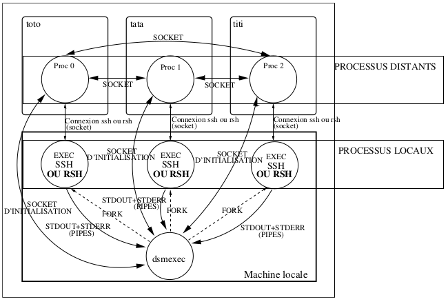
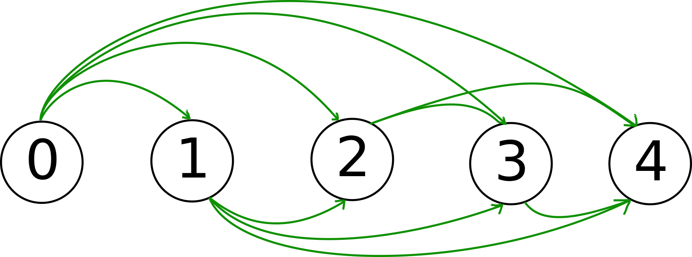
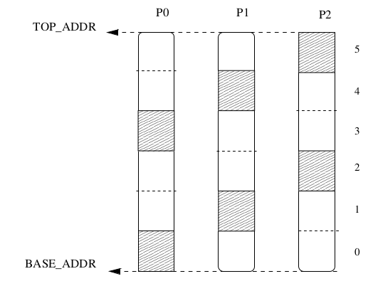
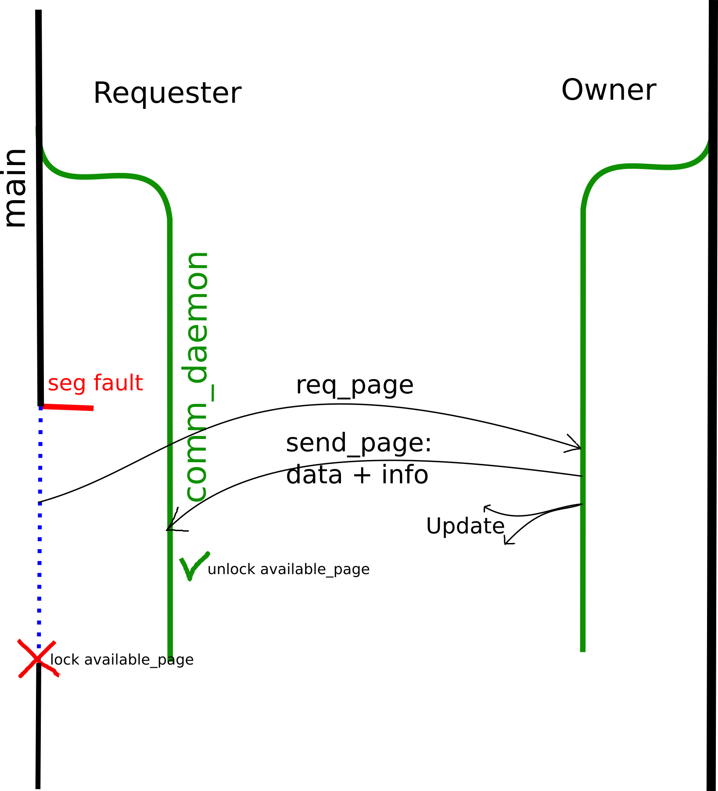

# Distributed_Shared_Memory

## Objectif et contexte du projet
Le but de ce projet est de mettre en place un logiciel permettant de partager de la mémoire virtuelle (i.e
des plages d’adresses) entre plusieurs processus répartis sur différentes machines physiques. Cette plage
d’adresses (qui sera identique pour tous les processus) sera divisée en un ensemble de pages mémoire, c’est-àdire un ensemble de blocs de 4ko. Tous les processus pourront donc travailler sur ces pages, c’est-à-dire lire
et écrire des données à l’intérieur mais seul un processus sera le propriétaire d’une page à un instant donné :
le processus propriétaire possède la page dans son espace d’adressage et y accède normalement, tandis que
si les autres processus essayent de lire ou d’écrire à l’intérieur, cela provoque une erreur de segmentation
(i.e segfault, signal numéro SIGSEGV, 11).

Quand cela arrive, il va s’agir de rattraper ce signal à l’aide d’un traitant adapté qui va :
<ol>
  <li>déterminer l’adresse qui a provoqué la délivrance du signal ;</li>
  <li>en déduire le numéro de page concernée ;</li>
  <li>en déduire le processus actuellement propriétaire ;</li>
  <li>envoyer une requête à ce processus pour qu’il envoie la page au processus demandeur, qui devient
donc le nouveau propriétaire de la page mémoire concernée.</li>
</ol>

Bien entendu le propriétaire actuel devra mettre à jour ses informations concernant cette page et libérer
cette dernière de son espace d’adressage tandis que le processus demandeur doit recevoir la page, l’allouer
et mettre à jour ses informations concernant cette dernière. Ces informations devront être également être
répercutées aux autres processus bien évidemment, afin que tous possèdent des informations cohérentes
sur l’état du système. Enfin, le processus demandeur va reprendre son exécution, mais comme il possède
désormais la page mémoire (elle fait maintenant partie physiquement de son espace d’adressage) il peut
travailler dessus.

## Architecture

Le processus dsmexec va donc devoir créer un ensemble de processus locaux (ie situés sur la même
machine que lui) avec lesquels il communiquera via une paire de tubes : un tube pour récupérer les informations de sortie standard et un autre pour récupérer les informations de sortie standard d’erreur. Ces processus vont devoir exécuter une commande ssh afin de créer les processus distants. En ce qui concerne la
redirection de stdout et stderr des processus distants vers les processus locaux, elle se fait automatiquement avec ssh. Vous allez donc devoir gérer uniquemeent les redirections des processus locaux exécutant
les commandes ssh vers le processus dsmexec. La figure 2 vous montre un exemple avec trois processus
distants lancés sur les machines toto,tata et titi.

Les processus distants (créés avec ssh) ne vont pas exécuter immédiatement la commande passée en
argument à dsmexec, mais vont exécuter un programme intermédiaire, appelé dsmwrap, dont le rôle
consiste à “nettoyer” la ligne de commande avant d’exécuter la bonne commande. C’est à dire que certains arguments passés à ssh vont être utilisés par dsmwrap, alors que la commande finale n’en n’a pas
besoin. L’utilisation d’un programme intermédiaire va permettre de créer un programme dsmexec qui
peut lancer tout type d’exécutables et pas seulement des programmes de DSM (qui font appel à dsm_init
donc).

De plus, Le processus dsmexec va communiquer pendant la phase d’initialisation avec tous les processus
distants via des sockets temporaires que l’on pourra fermer une fois cette phase terminée. Ensuite, ce processus va passer son temps à attendre que des données (des caractères) arrivent sur les tubes dédiés aux
événements sur stdout et stderr.

## Communications inter-processus et allocation initiale des pages

### Initialisation des connexions avec les autres processus

La fonction dsm_init commence d’abord par la récupération des variables d’environnement pour que chaque processus distant récupère les informations envoyées par le lanceur, les informations de connexion des autres processus sont stockées dans un tableau
nommé proc_conn_info de type dsm_proc_conn_t.

Après, c’est l’étape d’initialisation des connexions avec les autres processus : connect/accept. La subtilité dans cette étape est de pouvoir éviter que chacun des deux processus distants attend l’acceptation de connexion de l’autre ( double socket pour une
connexion) ce qui va bloquer le programme. C’est pour cela le protocole des connect/accept sera implémenté de la manière suivante : on accepte les connexions des autres
processus dsm de rang inférieur et on se connecte avec les autres processus dsm de rang
supérieur comme le montre la figure 2 avec les flèches de connections.

### Allocation des pages en tourniquet
Chaque processus dispose d’une table table_page où sont stockées des informations sur les pages mémoire : propriétaire de la page, état de la page le cas échéant.

Pendant cette étape l’allocation des pages est faite cycliquement (figure 3), et la plage
des adresses dans laquelle on travaillera sera comprise entre BASE_ADDR et TOP_ADDR.
Cette plage d’adresses est identique pour l’ensemble des processus. Pour cela on va
procéder à l’allocation que si le rang du processus est égale au reste de la division du
numéro de page avec le nombre total des processus :

## Protocole de communications inter-processus

Dans le programme exécutable exemple.c, il se peut qu’un processus distant essaie de lire dans une plage d’adresses déjà allouée par un autre processus. Dans ce
cas il reçoit un signal de type SIGSEGV qu’on devra s’assurer qu’il s’est passée entre
BASE_ADDR et TOP_ADDR afin de le différencier d’un SIGSEGV normal.
Après c’est la fonction dsm_handler qui va gérer la demande de cette page au propriétaire. Quant à la réception de la page, elle sera géré par son flux d’exécution
comm_deamon ce qui implique une synchronisation entre les deux flux.
Le protocole d’échanges des requêtes est décrit par la figure suivante :

Explication du protocole :

1- On stocke le numéro de la page demandée dans une variable accessible par le
comm_deamon pour vérifier lors de la réception de la page que c’est bien la page demandée (l’accès atomique est assuré par le mutex requested_page_mutex).

2- On envoi la demande de la page avec un message de type DSM_REQ en utilisant la
fonction dsm_send, la détermination de la socket convenable est assuré par la fonction
conn_info_get_index_by_rank qui retourne l’indice associé au rang dans le tableau
proc_conn_info.

3- L’attente de la page est assurée par le mutex available_page.

4- Le comm_deamon du propriétaire reçoit le message de type DSM_REQ et vérifie s’il
est bien le propriétaire de la page, sinon il ne fait rien. Du coup le demandeur restera bloqué jusqu’à ce que son comm_deamon reçoit un message de type DSM_UPDATE qui va
déverrouiller le mutex et donnera ainsi une nouvelle chance au demandeur (une nouvelle SIGSEGV). Si le demandeur reçoit une mise à jour concernant sa propre page il ne
l’accepte pas ! car le message de type DSM_UPDATE peut avoir un retard d’arrivée après
une nouvelle mise à jour.

5- Le comm_deamon envoie par la suite un en-tête (header) contenant le type du message (DSM_REQ),le numéro de la page pour la vérification de l’étape 1, puis le message
contenant les informations de la page et l’adresse de la page.

6- Le comm_deamon met à jour sa table_page, libère la page avec la fonction dsm_free_page
et envoie aux autres processus les nouvelles modifications avec un message de type
DSM_UPDATE.

7- Le comm_deamon du demandeur définit la variable receiving_timeout dans le cas
où il ne reçoit pas la page demandée pour des raisons divers. C’est pour cela à chaque
fois que la variable receiving_time_counter atteint receiving_timeout on déverrouille le mutex available_page et on essaie une nouvelle fois d’envoyer la demande
de la page pour éviter le blocage.

## Terminaison de la connection

dsm_finalize est censée s’exécuter à la fin des programmes qui utilisent le standard DSM. Son rôle est d’empêcher les processus de se terminer tant qu’il y a d’autres
qui sont encore en train de s’exécuter. Cela assure la disponibilité des pages jusqu’à ce
que le dernier processus termine son exécution.
Pour cela, dès qu’un processus arrive à la fonction dsm_finalize, il envoie des requêtes
de type DSM_FINALIZE à tous les autres processus. Ensuite le comm_deamon décrémente
le nombre des processus actifs. Lorsque ce nombre atteint le zéro, il ne reste qu’ à vérifier
si le flux principal a terminé son exécution à l’aide de la variable globale char finalize
(accés protégé par un mutex). Si les deux conditions sont vérifiées, le comm_deamon se
termine, le main fait un join et par la suite ferme les sockets, détruit les mutexes et
libère la mémoire allouée.

## Accès Atomique aux pages
Parmi, les fonctionnalités que nous avons jugé primordiales que bonus c’était d’offrir à l’ utilisateur des fonctions capables de synchroniser l’accès aux pages. Nous les
avons imaginées avec les prototypes suivants :
> void unlockpage (int page_num);
  void lockpage (int page_num);

Ce mécanisme empêche le comm_deamon d’envoyer la page jusqu’à ce que unlockpage soit appelée.
